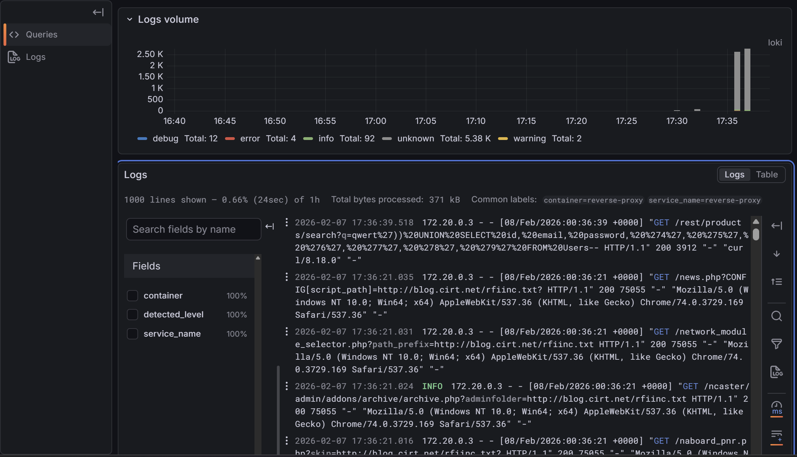
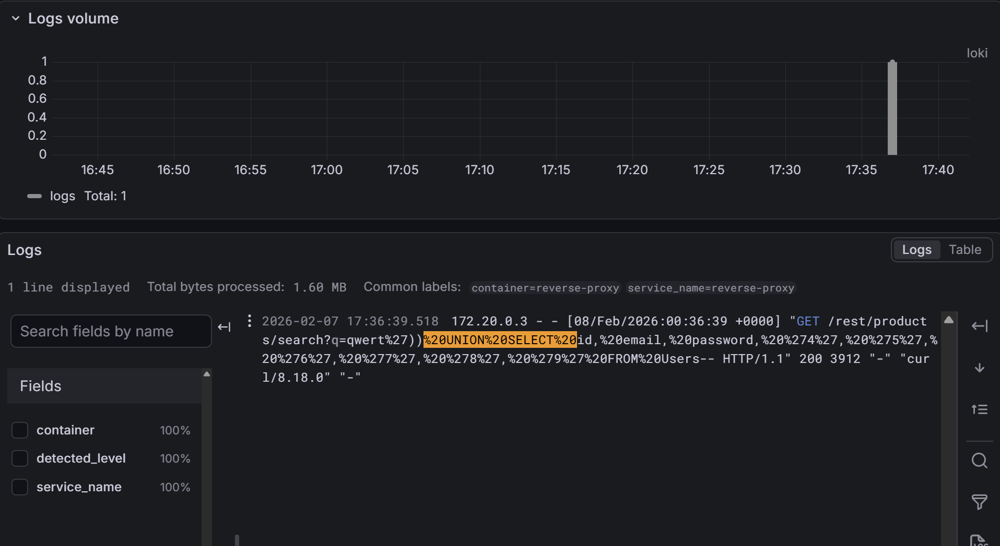

# Docker Security & Monitoring Homelab

This is a local security lab I built using Docker to get hands-on experience with network segmentation, web vulnerabilities, and log monitoring. I am currently learning about cyber-security/networking and wanted to move beyond the theory by building a functional, monitored environment from scratch.

Because I run this on a Snapdragon (Windows on ARM) laptop, all containers used in this project are configured to run natively on ARM64 architecture without emulation.

## The Setup

The lab is entirely containerized and managed via Docker Compose. 

* **Target:** OWASP Juice Shop (a deliberately vulnerable web app)
* **Proxy:** Nginx (acts as the entry point and generates access logs)
* **Attacker:** Kali Linux container
* **Logging Stack:** Promtail, Loki, and Grafana

### Network Architecture
I designed the lab with two separate Docker networks to mimic a basic DMZ setup:
* `frontend`: The Kali attacker container is isolated here. It can only see the Nginx reverse proxy.
* `backend`: The Nginx proxy forwards traffic here to the Juice Shop. The entire logging stack (Loki, Grafana, Promtail) also sits securely on this backend network.

## What I Did With It

Once the infrastructure was up, I used the Kali container to launch attacks against the proxy and used Grafana to catch the footprint of those attacks in real-time.

### 1. Generating Noise (Nikto Scan)
I started by running a standard Nikto web vulnerability scan (`nikto -h http://reverse-proxy`) from the attacker container. My goal was to see what a noisy, automated scan looks like on the defensive side. Promtail scraped the Nginx access logs, and I was able to visualize the massive spike in 404 and 500 HTTP errors in Grafana.

*Visualizing the high-volume traffic spike generated by the Nikto scanner.*

### 2. Precision Attack (SQL Injection)
Next, I simulated a manual SQL injection attack. I sent a malicious `UNION SELECT` payload through a `curl` request aimed at the Juice Shop's search endpoint. I then used Loki's query language (LogQL) in Grafana to filter the raw logs and successfully isolate the exact malicious payload passing through the proxy.

*Querying the Nginx logs in Grafana to catch the specific SQLi payload.*

## How to Run It

If you want to do this up locally:
1. Clone the repository.
2. Run `docker-compose up -d`.
3. Access the Grafana dashboard at `http://localhost:3000` (default creds: admin/admin).
4. Access the target web app at `http://localhost:8080`.
5. Attach to the attacker container using `docker exec -it attacker /bin/bash` to start exploring.
